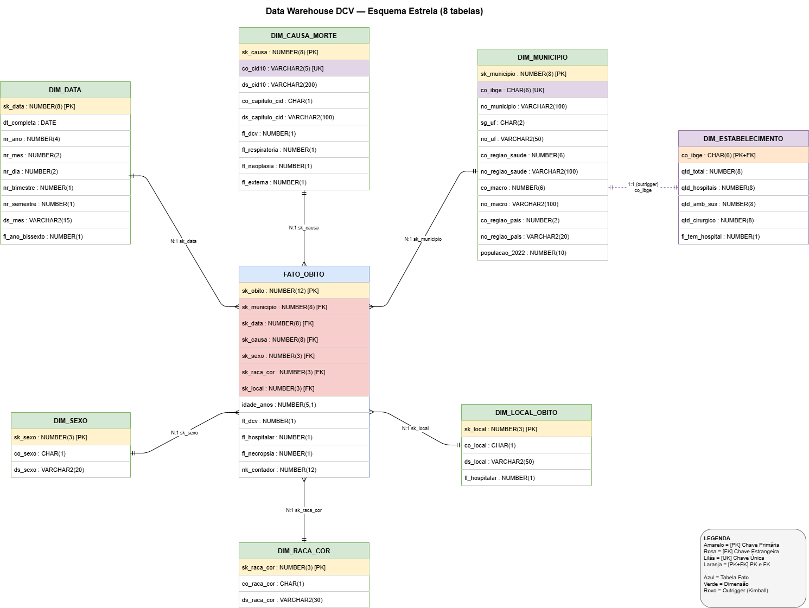
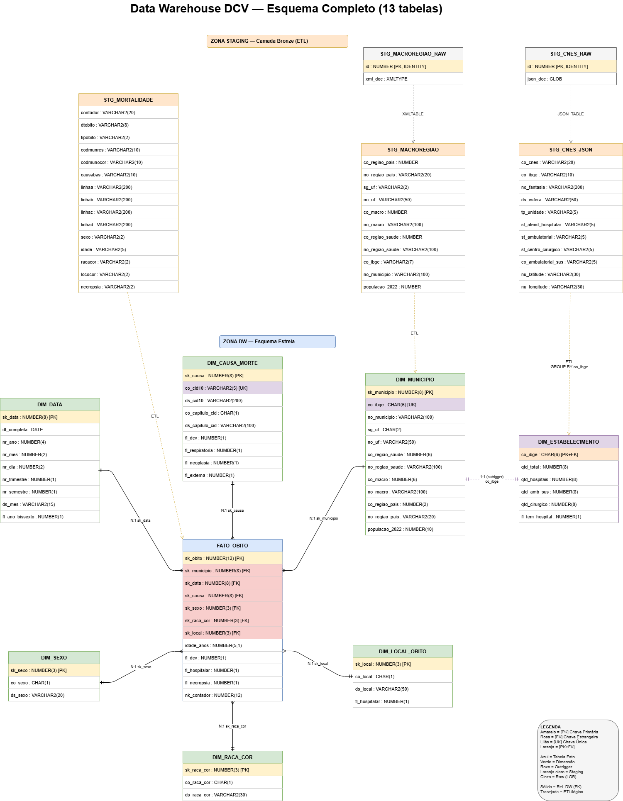
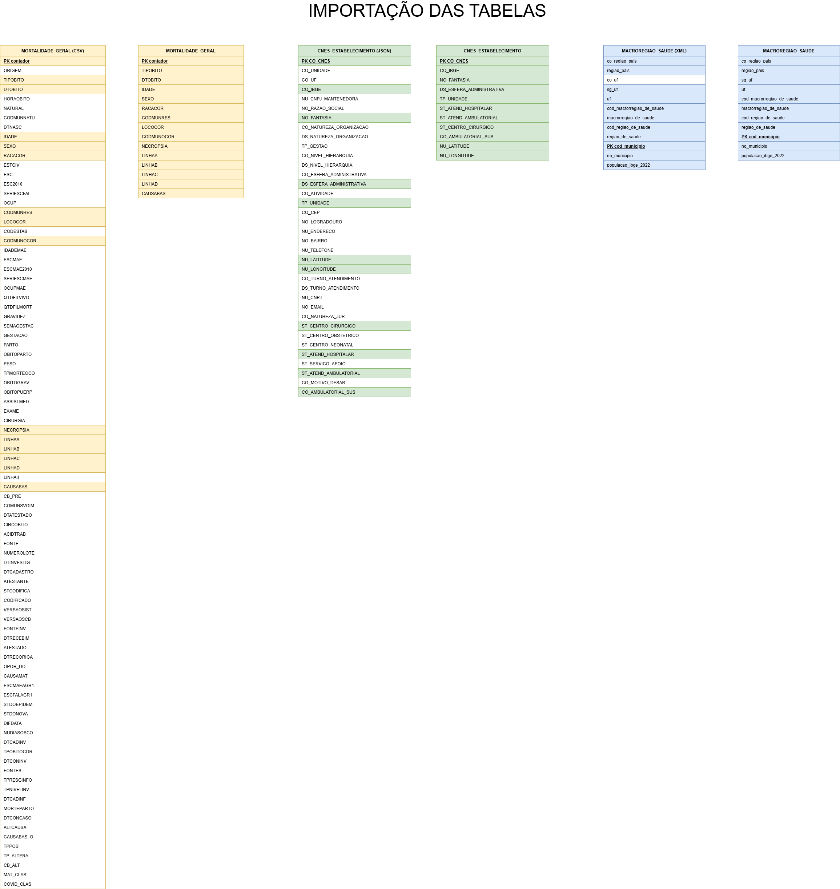

# T1 — Integração de Modelos em Data Warehouse e Consultas Analíticas

**Disciplina:** Integração e Preparação de Dados  
**Aluno:** Adriano Lúcio Uchôa Brandão  
**Aluno:** Herik Daurizio Ricardo  
**Professor:** Daniel dos Santos Kaster  
**Instituição:** Universidade Estadual de Londrina — UEL  
**Data de entrega:** 25/05/2026

---

## 1. Objetivo

Este trabalho propõe e implementa um Data Warehouse (DW) com o objetivo de analisar a relação entre mortalidade por Doenças Cardiovasculares (DCV) e a estrutura de saúde disponível nos municípios brasileiros.

**Pergunta central:**
> Municípios com maior densidade de estabelecimentos de saúde apresentam menores taxas de mortalidade por DCV?

Para responder a essa pergunta, foram integradas três fontes de dados heterogêneas (em formato CSV, JSON e XML) utilizando SQL nativo do Oracle Database. A chave de integração universal entre as fontes é o código IBGE do município (6 dígitos), presente nos três datasets.

O projeto cobre os temas centrais da disciplina: modelagem de dados (estruturada e semiestruturada), ETL em SQL com Oracle, Data Warehouse no esquema estrela, consultas OLAP com extensões de agrupamento e funções de janela.

---

## 2. Fontes de Dados

Três datasets foram utilizados, cada um em um formato diferente:

### 2.1 Mortalidade_Geral_2025 — CSV

**Arquivo:** `Mortalidade_Geral_2025.csv` (501 MB) — [Download](https://s3.sa-east-1.amazonaws.com/ckan.saude.gov.br/SIM/csv/Mortalidade_Geral_2025_csv.zip) · [Dicionário de dados](https://s3.sa-east-1.amazonaws.com/ckan.saude.gov.br/SIM/Dicionario_SIM_2025.pdf)  
**Papel:** fonte principal da tabela fato, 1 linha por óbito registrado no SIM (Sistema de Informação sobre Mortalidade), cobrindo todo o ano de 2025.

O campo `CAUSABAS` contém o CID-10 da causa básica do óbito. Filtrando os CIDs do capítulo I (I00–I99, Doenças do Aparelho Circulatório), obtemos os óbitos por DCV. O campo `CODMUNRES` é o código IBGE do município de residência do falecido, chave de integração com as demais fontes.

O CSV foi preferido ao JSON e XML do mesmo dataset (2 GB e 2,3 GB, respectivamente) por ser o menor e viável para carga direta.

**Problemas de qualidade encontrados:**
- `CAUSABAS` pode vir com asterisco prefixado (ex: `*I219`), sendo tratado com `REPLACE(causabas,'*','')`
- `IDADE` é codificada (primeiro dígito indica unidade de tempo: 4=anos, 3=meses, 2=dias, 1=horas, 5=centenários), sendo decodificada via `CASE SUBSTR(idade, 1, 1)` na carga da fato
- `DTOBITO` no formato `DDMMAAAA` como string, convertida com o guard `REGEXP_LIKE(dtobito, '^\d{8}$')` antes do `TO_DATE`
- Delimitador `;` (ponto e vírgula), e não vírgula, sendo configurado no Import Wizard do SQL Developer

### 2.2 cnes_estabelecimentos — JSON

**Arquivo:** `cnes_estabelecimentos.json` (581 MB) — [Download](https://s3.sa-east-1.amazonaws.com/ckan.saude.gov.br/CNES/cnes_estabelecimentos_json.zip)  
**Papel:** fonte da estrutura de saúde por município: quantidade de hospitais e outros estabelecimentos cadastrados no CNES (Cadastro Nacional de Estabelecimentos de Saúde).

O JSON foi escolhido em detrimento do CSV (211 MB) para demonstrar o uso de `SQL/JSON` do Oracle, conforme conteúdo da aula 04. A carga foi feita via `DBMS_LOB.LOADCLOBFROMFILE` (com `bfile_csid` para tratar encoding UTF-8) e normalização com `JSON_TABLE`.

**Problema de qualidade:** o campo `ST_ATEND_HOSPITALAR` chega como `"1.0"` (string com decimal) no JSON, não como `1` (inteiro). Por isso foi mantido como `VARCHAR2` na staging e comparado com `IN ('1','1.0')` nas transformações.

### 2.3 macroregiao_de_saude — XML

**Arquivo:** `macroregiao_de_saude.xml` (2,6 MB) — [Download](https://s3.sa-east-1.amazonaws.com/ckan.saude.gov.br/dbgeral/macroregiao_de_saude_xml.zip)  
**Papel:** fonte da dimensão geográfica — hierarquia completa (município → região de saúde → macrorregião → grande região do país) e o campo `populacao_ibge_2022`, que é o denominador do cálculo de taxa por 100 mil habitantes.

O XML foi escolhido por ser o menor arquivo disponível, ideal para uma demonstração limpa de `SQL/XML` com `XMLTABLE` (aula 03). A estrutura `<Rows><Row>...</Row></Rows>` foi mapeada com XPath `/Rows/Row`.

### 2.4 Datasets descartados e justificativa

**INFLUD25:** 170+ colunas, 364 MB, cobrindo SRAG/Influenza, tema diferente do eixo DCV. A complexidade seria desproporcional ao ganho analítico.

**taxa_mortalidade_dcv.csv:** continha a taxa de mortalidade por DCV já calculada externamente. Como os óbitos brutos estão na `Mortalidade_Geral_2025` e a população está no XML de macrorregiões, a taxa é calculada diretamente no SQL com `COUNT(*) * 100000.0 / populacao_2022`. Manter o dataset pré-calculado criaria redundância no modelo.

---

## 3. Modelo Dimensional

### 3.1 Arquitetura — Esquema Estrela

O DW foi modelado no esquema estrela com uma tabela fato central (`FATO_OBITO`) e seis dimensões. Uma sétima tabela (`DIM_ESTABELECIMENTO`) é conectada via `DIM_MUNICIPIO` no padrão *outrigger*.

**Por que esquema estrela?** O esquema estrela é o padrão para DWs analíticos (aula 05 — DW-OLAP): uma tabela fato central rodeada por dimensões desnormalizadas. Joins simples, boa performance em GROUP BY, compatível com ferramentas OLAP.

**Esquema estrela — 8 tabelas do DW:**



**Modelo completo com camada de staging — 13 tabelas:**



**Fluxo de importação das fontes:**



### 3.2 Tabela Fato: FATO_OBITO

**Granularidade:** um registro por óbito (mesmo nível do SIM original).

```sql
CREATE TABLE fato_obito (
    sk_obito      NUMBER(12) PRIMARY KEY,
    sk_municipio  NUMBER(8)  REFERENCES dim_municipio(sk_municipio),
    sk_data       NUMBER(8)  REFERENCES dim_data(sk_data),
    sk_causa      NUMBER(8)  REFERENCES dim_causa_morte(sk_causa),
    sk_sexo       NUMBER(3)  REFERENCES dim_sexo(sk_sexo),
    sk_raca_cor   NUMBER(3)  REFERENCES dim_raca_cor(sk_raca_cor),
    sk_local      NUMBER(3)  REFERENCES dim_local_obito(sk_local),
    idade_anos    NUMBER(5,1),
    fl_dcv        NUMBER(1)  DEFAULT 0,
    fl_hospitalar NUMBER(1)  DEFAULT 0,
    fl_necropsia  NUMBER(1)  DEFAULT 0,
    nk_contador   NUMBER(12)
);
```

O campo `fl_dcv` é uma flag binária pré-calculada na carga: vale `1` quando o CID da causa básica pertence ao capítulo I do CID-10. Isso evita expressões regulares nas consultas analíticas (`WHERE fl_dcv = 1` é simples e utilizável por índice).

O campo `nk_contador` mantém a chave natural do SIM para rastreabilidade, permitindo localizar o registro original na fonte se necessário.

**Resultado da carga:** 1.505.609 óbitos (staging: 1.507.424). Os filtros de qualidade descartaram 1.815 registros correspondentes a 23 códigos IBGE sem correspondência na `DIM_MUNICIPIO`, provavelmente municípios extintos, fusionados ou territórios não cobertos pelo XML de macrorregiões. O CSV do SIM utilizado não continha óbitos fetais (`tipobito = '1'`), portanto o filtro `tipobito = '2'` não descartou registros neste dataset.

### 3.3 Dimensões

**DIM_MUNICIPIO** — fonte: XML de macrorregiões. É a dimensão mais rica: além dos dados geográficos, contém `populacao_2022` (denominador das taxas por 100k hab).

**DIM_DATA** — gerada por script via `CONNECT BY LEVEL`, sem dependência de arquivo externo. A surrogate key é o próprio inteiro YYYYMMDD (ex: 20250315), o que permite filtros de range temporal sem JOIN.

**DIM_CAUSA_MORTE** — derivada do `DISTINCT` de `CAUSABAS` na staging. Contém os ~5.666 CIDs presentes nos dados, com flags pré-calculadas por grupo de causa (`fl_dcv`, `fl_respiratoria`, `fl_neoplasia`, `fl_externa`).

**DIM_SEXO, DIM_RACA_COR, DIM_LOCAL_OBITO** — dimensões de domínio fixo, populadas com INSERT direto baseado no dicionário de dados SIM. Três, seis e sete valores, respectivamente.

**DIM_ESTABELECIMENTO (outrigger)** — agrega o CNES por município (qtd_total, qtd_hospitais, qtd_cirurgico, fl_tem_hospital). Não é dimensão direta da fato: um óbito não tem um estabelecimento de saúde associado, mas sim um município de residência. A infraestrutura hospitalar é atributo do município, não do óbito. Por isso a tabela conecta via `DIM_MUNICIPIO.co_ibge`, não via `FATO_OBITO`. Esse padrão é conhecido em modelagem dimensional como outrigger.

---

## 4. Pipeline ETL

### 4.1 Visão geral

```
FONTES BRUTAS             STAGING (tabelas intermediárias)     DW — Esquema Estrela
──────────────            ────────────────────────────         ─────────────────────
Mortalidade.csv    ──→   STG_MORTALIDADE              ──→   FATO_OBITO
                                                              DIM_CAUSA_MORTE
cnes.json          ──→   STG_CNES_RAW                 ──→   DIM_ESTABELECIMENTO
                          STG_CNES_JSON
macroregiao.xml    ──→   STG_MACROREGIAO_RAW          ──→   DIM_MUNICIPIO
                          STG_MACROREGIAO
                                                              DIM_DATA
                                                              DIM_SEXO / DIM_RACA_COR
                                                              DIM_LOCAL_OBITO
```

A camada de staging preserva os dados originais sem transformação (todos os campos como `VARCHAR2`), separando claramente a responsabilidade de carga da responsabilidade de transformação. Erros de conversão na staging não corrompem o DW.

As duas tabelas `_RAW` existem porque JSON e XML exigem uma etapa de receptação do dado bruto (CLOB/XMLTYPE) antes da normalização via `JSON_TABLE` / `XMLTABLE`.

### 4.2 Carga do CSV — STG_MORTALIDADE

Feita pelo **Import Data Wizard do SQL Developer** ou pelo **SQL\*Loader** via linha de comando. O delimitador do SIM é `;` (ponto e vírgula), e foram selecionadas apenas 15 das 70 colunas do CSV original.

**Opção 1 — Import Data Wizard (SQL Developer):** Menu *Tools → Import Data*, selecionar o arquivo, configurar delimitador `;`, encoding `UTF-8` e mapear as 15 colunas para a tabela `STG_MORTALIDADE`.

**Opção 2 — SQL\*Loader:** criar o arquivo de controle abaixo e executar o comando via terminal:

```
-- mortalidade.ctl
LOAD DATA
CHARACTERSET UTF8
INFILE 'Mortalidade_Geral_2025.csv'
APPEND INTO TABLE stg_mortalidade
FIELDS TERMINATED BY ';'
OPTIONALLY ENCLOSED BY '"'
TRAILING NULLCOLS
(
    contador,
    dtobito,
    tipobito,
    codmunres,
    codmunocor,
    causabas,
    linhaa,
    linhab,
    linhac,
    linhad,
    sexo,
    idade,
    racacor,
    lococor,
    necropsia
)
```

```bash
sqlldr userid=usuario/senha@banco control=mortalidade.ctl log=mortalidade.log skip=1
```

O parâmetro `skip=1` descarta o cabeçalho do CSV. O log gerado pelo SQL\*Loader registra linhas rejeitadas e permite auditoria da carga.

**Resultado:** 1.507.424 linhas; zero registros sem causa, sem município ou com data inválida.

### 4.3 Carga do JSON — STG_CNES_JSON

O arquivo JSON foi carregado em uma tabela com coluna `CLOB` via PL/SQL:

```sql
DBMS_LOB.LOADCLOBFROMFILE(
    dest_lob     => v_clob,
    src_bfile    => BFILENAME('BRONZE_DIR', 'cnes_estabelecimentos.json'),
    amount       => DBMS_LOB.LOBMAXSIZE,
    dest_offset  => v_dest_offset,
    src_offset   => v_src_offset,
    bfile_csid   => NLS_CHARSET_ID('AL32UTF8'),
    lang_context => v_lang_context,
    warning      => v_warning
);
```

O uso de LOADCLOBFROMFILE foi necessário para preservar corretamente caracteres UTF-8 presentes no arquivo.

A normalização foi feita com `JSON_TABLE` (aula 04), que percorre o documento uma única vez e projeta todos os campos, permitindo extrair múltiplos atributos do JSON em uma única operação:

```sql
CREATE TABLE stg_cnes_json AS
SELECT jt.*
FROM stg_cnes_raw,
     JSON_TABLE(json_doc, '$[*]' COLUMNS (
         co_cnes             VARCHAR2(20)  PATH '$.CO_CNES',
         co_ibge             VARCHAR2(10)  PATH '$.CO_IBGE',
         no_fantasia         VARCHAR2(200) PATH '$.NO_FANTASIA',
         ds_esfera           VARCHAR2(50)  PATH '$.DS_ESFERA_ADMINISTRATIVA',
         tp_unidade          VARCHAR2(5)   PATH '$.TP_UNIDADE',
         st_atend_hospitalar VARCHAR2(5)   PATH '$.ST_ATEND_HOSPITALAR',
         st_ambulatorial     VARCHAR2(5)   PATH '$.ST_ATEND_AMBULATORIAL',
         st_centro_cirurgico VARCHAR2(5)   PATH '$.ST_CENTRO_CIRURGICO',
         co_ambulatorial_sus VARCHAR2(5)   PATH '$.CO_AMBULATORIAL_SUS',
         nu_latitude         VARCHAR2(30)  PATH '$.NU_LATITUDE',
         nu_longitude        VARCHAR2(30)  PATH '$.NU_LONGITUDE'
     )) jt;
```

**Resultado:** 612.561 estabelecimentos; 9.642 com atendimento hospitalar.

### 4.4 Carga do XML — STG_MACROREGIAO

```sql
CREATE TABLE stg_macroregiao AS
SELECT x.*
FROM stg_macroregiao_raw,
     XMLTABLE('/Rows/Row' PASSING xml_doc
         COLUMNS
             co_ibge        VARCHAR2(7)   PATH 'cod_municipio',
             no_municipio   VARCHAR2(100) PATH 'no_municipio',
             sg_uf          VARCHAR2(2)   PATH 'sg_uf',
             no_uf          VARCHAR2(50)  PATH 'uf',
             co_macro       NUMBER        PATH 'cod_macrorregiao_de_saude',
             no_macro       VARCHAR2(100) PATH 'macrorregiao_de_saude',
             co_regiao_pais NUMBER        PATH 'co_regiao_pais',
             no_regiao_pais VARCHAR2(20)  PATH 'regiao_pais',
             populacao_2022 NUMBER        PATH 'populacao_ibge_2022'
     ) x;
```

`XMLTABLE` é preferível a `EXTRACTVALUE`, que está deprecated desde Oracle 12c (aula 03). O XPath `/Rows/Row` navega até cada elemento `<Row>` do arquivo.

**Resultado:** 5.570 municípios; todos com `populacao_2022` preenchido.

### 4.5 Construção das dimensões

**DIM_DATA** foi gerada via `CONNECT BY LEVEL`, produzindo uma sequência contínua de datas.

```sql
SELECT DATE '2020-01-01' + LEVEL - 1 AS dt
FROM DUAL
CONNECT BY LEVEL <= DATE '2025-12-31' - DATE '2020-01-01' + 1
```

**DIM_CAUSA_MORTE** foi derivada do `DISTINCT` de `CAUSABAS` na staging. Um aspecto importante: em Oracle, `''` (string vazia) é idêntico a `NULL`. Por isso, o filtro `NOT IN ('', '000', '999')` eliminaria silenciosamente todas as linhas, já que qualquer comparação `val <> NULL` retorna `UNKNOWN`. A forma correta é:

```sql
WHERE TRIM(causabas) IS NOT NULL
  AND TRIM(causabas) NOT IN ('000', '999')
```

**DIM_MUNICIPIO** requer padronização do código IBGE (campo pode vir com 7 dígitos no XML) e remoção do prefixo "UF - " nos nomes dos municípios:

```sql
LPAD(TO_NUMBER(TRIM(co_ibge)), 6, '0')  AS co_ibge,
TRIM(SUBSTR(no_municipio, 6))           AS no_municipio
```

### 4.6 Carga da FATO_OBITO

A carga integra a staging com todas as dimensões via JOIN. O join no município é INNER (descarta registros sem município válido). Os demais são LEFT JOIN com fallback para "Ignorado":

```sql
INSERT INTO fato_obito ( ... )
SELECT
    ROWNUM AS sk_obito,
    m.sk_municipio,
    TO_NUMBER(TO_CHAR(TO_DATE(s.dtobito, 'DDMMYYYY'), 'YYYYMMDD')) AS sk_data,
    NVL(c.sk_causa, 0) AS sk_causa,
    NVL(sx.sk_sexo, 9) AS sk_sexo,
    NVL(rc.sk_raca_cor, 9) AS sk_raca_cor,
    NVL(lo.sk_local, 9) AS sk_local,
    CASE
        WHEN SUBSTR(s.idade, 1, 1) = '4' THEN TO_NUMBER(SUBSTR(s.idade, 2))
        WHEN SUBSTR(s.idade, 1, 1) = '3' THEN ROUND(TO_NUMBER(SUBSTR(s.idade, 2)) / 12.0, 1)
        WHEN SUBSTR(s.idade, 1, 1) IN ('1','2') THEN 0
        WHEN SUBSTR(s.idade, 1, 1) = '5' THEN TO_NUMBER(SUBSTR(s.idade, 2)) + 100
        ELSE NULL
    END AS idade_anos,
    CASE WHEN REGEXP_LIKE(TRIM(REPLACE(UPPER(s.causabas),'*','')), '^I[0-9]')
         THEN 1 ELSE 0 END AS fl_dcv,
    CASE WHEN TRIM(s.lococor) = '1' THEN 1 ELSE 0 END AS fl_hospitalar,
    CASE WHEN UPPER(TRIM(s.necropsia)) = 'S' THEN 1 ELSE 0 END AS fl_necropsia,
    TO_NUMBER(s.contador) AS nk_contador
FROM stg_mortalidade s
JOIN dim_municipio m
    ON LPAD(TO_NUMBER(TRIM(s.codmunres)), 6, '0') = m.co_ibge
LEFT JOIN dim_causa_morte c
    ON TRIM(REPLACE(UPPER(s.causabas),'*','')) = c.co_cid10
LEFT JOIN dim_sexo sx      ON TRIM(s.sexo)    = sx.co_sexo
LEFT JOIN dim_raca_cor rc  ON TRIM(s.racacor) = rc.co_raca_cor
LEFT JOIN dim_local_obito lo ON TRIM(s.lococor) = lo.co_local
WHERE TRIM(s.codmunres) IS NOT NULL
  AND TRIM(s.codmunres) != '000000'
  AND REGEXP_LIKE(TRIM(s.codmunres), '^[0-9]+$')
  AND REGEXP_LIKE(s.dtobito, '^\d{8}$')
  AND TRIM(s.tipobito) = '2';
```

O guard `REGEXP_LIKE(dtobito, '^\d{8}$')` é necessário porque o SIM tem registros com datas zeradas (`00000000`) que causariam `ORA-01861` no `TO_DATE`.

### 4.7 Índices

```sql
CREATE INDEX idx_fato_municipio ON fato_obito(sk_municipio);
CREATE INDEX idx_fato_data      ON fato_obito(sk_data);
CREATE INDEX idx_fato_causa     ON fato_obito(sk_causa);
CREATE INDEX idx_fato_fl_dcv    ON fato_obito(fl_dcv);
```

O índice em `fl_dcv` é particularmente útil: todas as consultas analíticas filtram `WHERE fl_dcv = 1`, e sem índice isso causaria full scan em ~1,5 milhão de linhas.

---

## 5. Consultas Analíticas

As sete consultas analíticas demonstram diferentes técnicas SQL avançadas sobre o DW construído.

### Q1 — Evolução temporal por região (GROUP BY + ROLLUP)

```sql
SELECT
    d.nr_ano,
    d.nr_mes,
    m.no_regiao_pais,
    COUNT(*)                                        AS total_obitos,
    SUM(f.fl_dcv)                                   AS obitos_dcv,
    ROUND(SUM(f.fl_dcv) * 100.0 / COUNT(*), 2)     AS pct_dcv
FROM fato_obito f
JOIN dim_data d      ON f.sk_data      = d.sk_data
JOIN dim_municipio m ON f.sk_municipio = m.sk_municipio
WHERE d.nr_ano >= 2025
GROUP BY ROLLUP(d.nr_ano, d.nr_mes, m.no_regiao_pais)
ORDER BY d.nr_ano, d.nr_mes, m.no_regiao_pais;
```

**Técnica:** `ROLLUP` (aula 05) gera subtotais hierárquicos automáticos percorrendo a lista de colunas da direita para a esquerda. Para 3 colunas, gera 4 níveis de detalhe: detalhe completo, subtotal por (ano, mês), subtotal por (ano) e total geral. As linhas de subtotal têm `NULL` nas colunas recolhidas. Isso permite obter subtotais e total geral em uma única consulta.

`SUM(f.fl_dcv)` funciona como contagem de DCV porque `fl_dcv` é binário; somar 0s e 1s equivale a `COUNT(*) WHERE fl_dcv = 1`, permitindo calcular totais e subtotais na mesma consulta.

**Resultado:** Total de 1.505.609 óbitos em 2025; 382.363 (25,4%) por DCV. Pico de mortalidade em julho (26,27% DCV) e queda pronunciada em dezembro (24,35%, provavelmente devido à subnotificação, já que registros de dezembro entram no SIM em janeiro ou fevereiro do ano seguinte). O Sudeste apresenta o maior percentual de DCV (~27%), o Norte o menor (~23%).

**Amostra dos resultados** *(primeiras 20 linhas — resultado completo: [Q1.pdf](results/Q1.pdf))*:

| NR_ANO | NR_MES | NO_REGIAO_PAIS | TOTAL_OBITOS | OBITOS_DCV | PCT_DCV |
|--------|--------|----------------|--------------|------------|---------|
| 2025 | 1 | Centro-Oeste | 8745 | 2217 | 25.35 |
| 2025 | 1 | Nordeste | 32754 | 8327 | 25.42 |
| 2025 | 1 | Norte | 8301 | 2071 | 24.95 |
| 2025 | 1 | Sudeste | 55917 | 14195 | 25.39 |
| 2025 | 1 | Sul | 18283 | 4373 | 23.92 |
| 2025 | 1 | (null) | 124000 | 31183 | 25.15 |
| 2025 | 2 | Centro-Oeste | 7730 | 1974 | 25.54 |
| 2025 | 2 | Nordeste | 29231 | 7366 | 25.20 |
| 2025 | 2 | Norte | 7470 | 1905 | 25.50 |
| 2025 | 2 | Sudeste | 50496 | 12582 | 24.92 |
| 2025 | 2 | Sul | 16600 | 4040 | 24.34 |
| 2025 | 2 | (null) | 111527 | 27867 | 24.99 |
| 2025 | 3 | Centro-Oeste | 8431 | 2080 | 24.67 |
| 2025 | 3 | Nordeste | 32666 | 8460 | 25.90 |
| 2025 | 3 | Norte | 8212 | 2030 | 24.72 |
| 2025 | 3 | Sudeste | 54635 | 13647 | 24.98 |
| 2025 | 3 | Sul | 18525 | 4347 | 23.47 |
| 2025 | 3 | (null) | 122469 | 30564 | 24.96 |
| 2025 | 4 | Centro-Oeste | 8721 | 2083 | 23.88 |
| 2025 | 4 | Nordeste | 31906 | 8197 | 25.69 |

---

### Q2 — Comparação multidimensional (CUBE)

```sql
SELECT
    NVL(m.no_regiao_pais, 'TOTAL BRASIL')  AS regiao,
    NVL(m.no_macro,       'TOTAL MACRO')   AS macrorregiao,
    NVL(s.ds_sexo,        'AMBOS SEXOS')   AS sexo,
    COUNT(*)                               AS total_obitos_dcv,
    TRUNC(AVG(f.idade_anos))               AS idade_media_obito
FROM fato_obito f
JOIN dim_municipio m   ON f.sk_municipio = m.sk_municipio
JOIN dim_sexo s        ON f.sk_sexo      = s.sk_sexo
WHERE f.fl_dcv = 1
  AND s.co_sexo IN ('1', '2')
GROUP BY CUBE(m.no_regiao_pais, m.no_macro, s.ds_sexo);
```

**Técnica:** `CUBE` (aula 05) gera automaticamente todas as combinações possíveis de subtotal entre as dimensões utilizadas, diferente do `ROLLUP` que pressupõe hierarquia. É adequado aqui porque região, macrorregião e sexo não têm relação hierárquica entre si, fazendo com que todas as combinações de subtotais tenham valor analítico. `NVL` converte os NULLs gerados pelo CUBE em rótulos legíveis. O filtro `co_sexo IN ('1', '2')` exclui o código 9 (ignorado) para que os subtotais de "AMBOS SEXOS" somem exatamente Masculino + Feminino.

**Resultado:** 382.337 óbitos DCV com sexo definido. Feminino: 179.395 óbitos, idade média 75 anos. Masculino: 202.942 óbitos, idade média 70 anos. O gap de 5 anos é consistente em todas as macrorregiões, refletindo o efeito cardioprotetor do estrogênio nas mulheres até a menopausa. Nas macrorregiões da periferia de São Paulo (RRAS3, RRAS4), o masculino morre de DCV em média com 65 anos; no interior do Rio Grande do Sul (VALES, MISSIONEIRA), com 72 anos.

**Amostra dos resultados** *(primeiras 20 linhas — resultado completo: [Q2.pdf](results/Q2.pdf))*:

| REGIAO | MACRORREGIAO | SEXO | TOTAL_OBITOS_DCV | IDADE_MEDIA_OBITO |
|--------|--------------|------|-----------------|-------------------|
| TOTAL BRASIL | TOTAL MACRO | AMBOS SEXOS | 382337 | 72 |
| TOTAL BRASIL | TOTAL MACRO | Feminino | 179395 | 75 |
| TOTAL BRASIL | TOTAL MACRO | Masculino | 202942 | 70 |
| TOTAL BRASIL | SUL | AMBOS SEXOS | 8088 | 73 |
| TOTAL BRASIL | SUL | Feminino | 3791 | 76 |
| TOTAL BRASIL | SUL | Masculino | 4297 | 70 |
| TOTAL BRASIL | LESTE | AMBOS SEXOS | 2033 | 74 |
| TOTAL BRASIL | LESTE | Feminino | 933 | 76 |
| TOTAL BRASIL | LESTE | Masculino | 1100 | 72 |
| TOTAL BRASIL | NORTE | AMBOS SEXOS | 5081 | 74 |
| TOTAL BRASIL | NORTE | Feminino | 2395 | 76 |
| TOTAL BRASIL | NORTE | Masculino | 2686 | 71 |
| TOTAL BRASIL | OESTE | AMBOS SEXOS | 2746 | 73 |
| TOTAL BRASIL | OESTE | Feminino | 1250 | 75 |
| TOTAL BRASIL | OESTE | Masculino | 1496 | 71 |
| TOTAL BRASIL | RRAS1 | AMBOS SEXOS | 6599 | 71 |
| TOTAL BRASIL | RRAS1 | Feminino | 3059 | 75 |
| TOTAL BRASIL | RRAS1 | Masculino | 3540 | 67 |
| TOTAL BRASIL | RRAS2 | AMBOS SEXOS | 5865 | 69 |
| TOTAL BRASIL | RRAS2 | Feminino | 2754 | 72 |

---

### Q3 — Taxa DCV × estrutura hospitalar (consulta principal)

```sql
SELECT
    m.no_municipio, m.no_uf, m.no_macro,
    e.qtd_hospitais,
    COUNT(*)                                                            AS obitos_dcv,
    ROUND(COUNT(*) * 100000.0 / NULLIF(m.populacao_2022, 0), 2)        AS taxa_dcv_por_100k,
    ROUND(e.qtd_hospitais * 100000.0 / NULLIF(m.populacao_2022, 0), 4) AS hospitais_por_100k
FROM fato_obito f
JOIN dim_municipio m       ON f.sk_municipio = m.sk_municipio
JOIN dim_estabelecimento e ON m.co_ibge      = e.co_ibge
WHERE f.fl_dcv = 1
  AND m.populacao_2022 > 0
GROUP BY m.no_municipio, m.no_uf, m.no_macro,
         e.qtd_hospitais, m.populacao_2022
ORDER BY taxa_dcv_por_100k DESC
FETCH FIRST 30 ROWS ONLY;
```

**Técnica:** `NULLIF(x, 0)` retorna NULL quando x = 0, evitando `ORA-01476` (divisão por zero) sem precisar de `CASE WHEN`. O JOIN com `DIM_ESTABELECIMENTO` é feito via `co_ibge` (não via chave surrogate), pois a `DIM_ESTABELECIMENTO` é um outrigger conectado à `DIM_MUNICIPIO`, não uma dimensão direta da fato. `FETCH FIRST n ROWS ONLY` limita a quantidade de linhas retornadas pela consulta.

A taxa por 100 mil habitantes é o indicador epidemiológico padrão para comparar municípios com populações diferentes. Sem normalização, municípios populosos sempre teriam números absolutos maiores, o que não refletiria risco real.

**Resultado:** Os 30 municípios com maiores taxas são quase todos municípios pequenos do Sul, visto que 22 dos 30 (73%) têm zero hospitais. O padrão é consistente com a hipótese. Porém, há limitação estatística importante: Flora Rica (SP) tem apenas 14 óbitos sobre ~1.500 habitantes, gerando taxa de 941/100k. O valor é matematicamente correto, mas epidemiologicamente instável. Para análise rigorosa, um filtro mínimo de eventos (`HAVING COUNT(*) >= 30`) reduziria esse ruído.

**Amostra dos resultados** *(primeiras 20 linhas — resultado completo: [Q3.pdf](results/Q3.pdf))*:

| NO_MUNICIPIO | NO_UF | NO_MACRO | QTD_HOSPITAIS | OBITOS_DCV | TAXA_DCV_POR_100K | HOSPITAIS_POR_100K |
|---|---|---|---:|---:|---:|---:|
| FLORA RICA | São Paulo | RRAS11 | 0 | 14 | 941.49 | 0 |
| NOVA PALMA | Rio Grande do Sul | CENTRO-OESTE | 1 | 36 | 644.47 | 17.9019 |
| UNIAO DA SERRA | Rio Grande do Sul | SERRA | 0 | 7 | 598.29 | 0 |
| CENTENARIO | Rio Grande do Sul | NORTE | 0 | 16 | 586.51 | 0 |
| SAO JOAO DO POLESINE | Rio Grande do Sul | CENTRO-OESTE | 1 | 15 | 566.25 | 37.7501 |
| ANAHY | Paraná | MACRORREGIAO OESTE | 0 | 16 | 548.32 | 0 |
| MIRADOR | Paraná | MACRORREGIONAL NOROESTE | 0 | 12 | 536.19 | 0 |
| GUARANI DAS MISSOES | Rio Grande do Sul | MISSIONEIRA | 1 | 39 | 525.96 | 13.4862 |
| ANTONIO PRADO DE MINAS | Minas Gerais | SUDESTE | 0 | 8 | 520.16 | 0 |
| MONCOES | São Paulo | RRAS12 | 0 | 10 | 516.26 | 0 |
| ARIRANHA DO IVAI | Paraná | MACRORREGIONAL NORTE | 0 | 12 | 515.24 | 0 |
| NOVA GUATAPORANGA | São Paulo | RRAS11 | 0 | 11 | 510.20 | 0 |
| SAO BONIFACIO | Santa Catarina | GRANDE FLORIANOPOLIS | 1 | 15 | 509.16 | 33.9443 |
| ERVAL GRANDE | Rio Grande do Sul | NORTE | 0 | 25 | 507.10 | 0 |
| ALOANDIA | Goiás | MACRORREGIAO CENTRO SUDESTE | 1 | 10 | 506.84 | 50.6842 |
| PAIM FILHO | Rio Grande do Sul | NORTE | 0 | 18 | 495.73 | 27.5406 |
| SAO MARTINHO DA SERRA | Rio Grande do Sul | CENTRO-OESTE | 0 | 14 | 489.51 | 0 |
| BARRA BONITA | Santa Catarina | GRANDE OESTE | 0 | 8 | 479.62 | 0 |
| FLORIANO PEIXOTO | Rio Grande do Sul | NORTE | 0 | 8 | 479.62 | 0 |
| PARAISO DO SUL | Rio Grande do Sul | CENTRO-OESTE | 1 | 30 | 460.19 | 15.3398 |


---

### Q4 — Ranking de municípios por taxa DCV (RANK)

```sql
SELECT
    m.no_municipio, m.sg_uf, m.no_macro,
    COUNT(*)                                                       AS obitos_dcv,
    ROUND(COUNT(*) * 100000.0 / NULLIF(m.populacao_2022, 0), 2)   AS taxa_dcv_por_100k,
    RANK() OVER (
        PARTITION BY m.no_macro
        ORDER BY COUNT(*) * 100000.0 / NULLIF(m.populacao_2022, 0) DESC
    ) AS rank_na_macro,
    RANK() OVER (
        ORDER BY COUNT(*) * 100000.0 / NULLIF(m.populacao_2022, 0) DESC
    ) AS rank_nacional
FROM fato_obito f
JOIN dim_municipio m ON f.sk_municipio = m.sk_municipio
WHERE f.fl_dcv = 1
GROUP BY m.no_municipio, m.sg_uf, m.no_macro, m.co_ibge, m.populacao_2022
ORDER BY rank_nacional
FETCH FIRST 50 ROWS ONLY;
```

**Técnica:** `RANK()` é uma função de janela (window function) que atribui posições sem colapsar linhas, diferentemente do `GROUP BY`. A cláusula `OVER (PARTITION BY m.no_macro ORDER BY ... DESC)` define uma "janela" por macrorregião onde o ranking recomeça do 1. A segunda chamada `RANK() OVER (ORDER BY ... DESC)` sem `PARTITION BY` opera sobre toda a tabela, produzindo o ranking nacional. `RANK()` atribui a mesma posição para empates e pula a posição seguinte (1, 2, 2, 4), mantendo empates na mesma posição do ranking. O campo `m.co_ibge` está no GROUP BY (mas não no SELECT) para diferenciar municípios homônimos em estados diferentes.

**Resultado:** Na posição 18, empate exato entre Barra Bonita (SC) e Floriano Peixoto (RS), ambos com 479,62/100k. `RANK()` atribui 18 para os dois e pula para 20. Floriano Peixoto tem `rank_na_macro = 4` dentro da macrorregião NORTE/RS, mas `rank_nacional = 18`: existem 3 municípios na mesma macro com taxas piores. Isso revela que toda a macrorregião NORTE tem taxas elevadas, não é um outlier isolado. O RS responde por ~50% do top 50 nacional.

**Amostra dos resultados** *(primeiras 20 linhas — resultado completo: [Q4.pdf](results/Q4.pdf))*:

| NO_MUNICIPIO | SG_UF | NO_MACRO | OBITOS_DCV | TAXA_DCV_POR_100K | RANK_NA_MACRO | RANK_NACIONAL |
|---|:---:|---|---:|---:|---:|---:|
| FLORA RICA | SP | RRAS11 | 14 | 941.49 | 1 | 1 |
| NOVA PALMA | RS | CENTRO-OESTE | 36 | 644.47 | 1 | 2 |
| UNIAO DA SERRA | RS | SERRA | 7 | 598.29 | 1 | 3 |
| CENTENARIO | RS | NORTE | 16 | 586.51 | 1 | 4 |
| SAO JOAO DO POLESINE | RS | CENTRO-OESTE | 15 | 566.25 | 2 | 5 |
| ANAHY | PR | MACRORREGIAO OESTE | 16 | 548.32 | 1 | 6 |
| MIRADOR | PR | MACRORREGIONAL NOROESTE | 12 | 536.19 | 1 | 7 |
| GUARANI DAS MISSOES | RS | MISSIONEIRA | 39 | 525.96 | 1 | 8 |
| ANTONIO PRADO DE MINAS | MG | SUDESTE | 8 | 520.16 | 1 | 9 |
| MONCOES | SP | RRAS12 | 10 | 516.26 | 1 | 10 |
| ARIRANHA DO IVAI | PR | MACRORREGIONAL NORTE | 12 | 515.24 | 1 | 11 |
| NOVA GUATAPORANGA | SP | RRAS11 | 11 | 510.20 | 2 | 12 |
| SAO BONIFACIO | SC | GRANDE FLORIANOPOLIS | 15 | 509.16 | 1 | 13 |
| ERVAL GRANDE | RS | NORTE | 25 | 507.10 | 2 | 14 |
| ALOANDIA | GO | MACRORREGIAO CENTRO SUDESTE | 10 | 506.84 | 1 | 15 |
| PAIM FILHO | RS | NORTE | 18 | 495.73 | 3 | 16 |
| SAO MARTINHO DA SERRA | RS | CENTRO-OESTE | 14 | 489.51 | 3 | 17 |
| BARRA BONITA | SC | GRANDE OESTE | 8 | 479.62 | 1 | 18 |
| FLORIANO PEIXOTO | RS | NORTE | 8 | 479.62 | 4 | 18 |
| PARAISO DO SUL | RS | CENTRO-OESTE | 30 | 460.19 | 4 | 20 |

---

### Q5 — Perfil dos óbitos por DCV (CASE + GROUP BY)

```sql
SELECT
    s.ds_sexo, rc.ds_raca_cor,
    CASE
        WHEN f.idade_anos < 40 THEN 'A. Menos de 40 anos'
        WHEN f.idade_anos < 60 THEN 'B. 40-59 anos'
        WHEN f.idade_anos < 70 THEN 'C. 60-69 anos'
        WHEN f.idade_anos < 80 THEN 'D. 70-79 anos'
        ELSE                        'E. 80 anos ou mais'
    END AS faixa_etaria,
    COUNT(*) AS total_obitos,
    ROUND(COUNT(*) * 100.0 / SUM(COUNT(*)) OVER (), 2) AS pct_total
FROM fato_obito f
JOIN dim_sexo s      ON f.sk_sexo     = s.sk_sexo
JOIN dim_raca_cor rc ON f.sk_raca_cor = rc.sk_raca_cor
WHERE f.fl_dcv = 1
  AND s.co_sexo != '9'
GROUP BY
    s.ds_sexo, rc.ds_raca_cor,
    CASE
        WHEN f.idade_anos < 40 THEN 'A. Menos de 40 anos'
        WHEN f.idade_anos < 60 THEN 'B. 40-59 anos'
        WHEN f.idade_anos < 70 THEN 'C. 60-69 anos'
        WHEN f.idade_anos < 80 THEN 'D. 70-79 anos'
        ELSE                        'E. 80 anos ou mais'
    END
ORDER BY s.ds_sexo, faixa_etaria;
```

**Técnica:** O `CASE` transforma a idade contínua em faixas etárias categóricas. Os prefixos foram utilizados para manter a ordenação correta das faixas etárias no resultado final. O `CASE` precisa ser repetido integralmente no `GROUP BY` (limitação do SQL padrão: aliases do SELECT não são válidos no GROUP BY no Oracle). `SUM(COUNT(*)) OVER ()` foi utilizada para calcular a participação percentual de cada grupo em relação ao total de óbitos por DCV.

**Resultado:** O achado mais relevante é a inversão após os 80 anos: das faixas 40–79, os homens morrem mais por DCV (razão de até 1,75 na faixa 40-59). Acima dos 80, as mulheres morrem mais, não por maior vulnerabilidade cardiovascular, mas porque chegam em maior número ao grupo 80+ (maior expectativa de vida). O maior grupo isolado é "Feminino Branca 80+" com 47.818 óbitos (12,51% do total DCV).

**Amostra dos resultados** *(primeiras 20 linhas — resultado completo: [Q5.pdf](results/Q5.pdf))*:

| DS_SEXO | DS_RACA_COR | FAIXA_ETARIA | TOTAL_OBITOS | PCT_TOTAL |
|---------|-------------|--------------|-------------:|----------:|
| Feminino | Amarela | A. Menos de 40 anos | 11 | 0.00 |
| Feminino | Branca | A. Menos de 40 anos | 1432 | 0.37 |
| Feminino | Ignorada | A. Menos de 40 anos | 44 | 0.01 |
| Feminino | Indígena | A. Menos de 40 anos | 22 | 0.01 |
| Feminino | Parda | A. Menos de 40 anos | 1880 | 0.49 |
| Feminino | Preta | A. Menos de 40 anos | 444 | 0.12 |
| Feminino | Amarela | B. 40-59 anos | 79 | 0.02 |
| Feminino | Branca | B. 40-59 anos | 8374 | 2.19 |
| Feminino | Ignorada | B. 40-59 anos | 211 | 0.06 |
| Feminino | Indígena | B. 40-59 anos | 64 | 0.02 |
| Feminino | Parda | B. 40-59 anos | 9994 | 2.61 |
| Feminino | Preta | B. 40-59 anos | 2888 | 0.76 |
| Feminino | Amarela | C. 60-69 anos | 120 | 0.03 |
| Feminino | Branca | C. 60-69 anos | 13381 | 3.50 |
| Feminino | Ignorada | C. 60-69 anos | 325 | 0.09 |
| Feminino | Indígena | C. 60-69 anos | 61 | 0.02 |
| Feminino | Parda | C. 60-69 anos | 11954 | 3.13 |
| Feminino | Preta | C. 60-69 anos | 3393 | 0.89 |
| Feminino | Amarela | D. 70-79 anos | 247 | 0.06 |
| Feminino | Branca | D. 70-79 anos | 23580 | 6.17 |

---

### Q6 — Variação mensal de óbitos por DCV (LAG)

```sql
SELECT
    m.no_macro, d.nr_ano, d.nr_mes,
    COUNT(*)                         AS obitos_dcv,
    LAG(COUNT(*)) OVER (
        PARTITION BY m.no_macro
        ORDER BY d.nr_ano, d.nr_mes
    )                                AS obitos_mes_anterior,
    COUNT(*) - LAG(COUNT(*)) OVER (
        PARTITION BY m.no_macro
        ORDER BY d.nr_ano, d.nr_mes
    )                                AS variacao_absoluta
FROM fato_obito f
JOIN dim_municipio m ON f.sk_municipio = m.sk_municipio
JOIN dim_data d      ON f.sk_data      = d.sk_data
WHERE f.fl_dcv = 1
GROUP BY m.no_macro, d.nr_ano, d.nr_mes
ORDER BY m.no_macro, d.nr_ano, d.nr_mes;
```

**Técnica:** `LAG(expr)` retorna o valor da linha anterior dentro da janela definida por `PARTITION BY`. A partição por macrorregião garante que a série temporal de cada macro é independente. `ORDER BY d.nr_ano, d.nr_mes` define o que significa "linha anterior" (cronologicamente). A primeira linha de cada partição retorna `NULL` corretamente, pois não existe mês anterior. Antes das funções de janela, isso exigiria um self-join com lógica manual de "mês anterior", percorrendo a tabela duas vezes.

**Resultado:** Todas as macrorregiões exibem pico entre maio–agosto (inverno) e queda em dezembro. A macrorregião CENTRO caiu de 953 óbitos em novembro para 395 em dezembro (-58%), impossível de explicar epidemiologicamente, sugerindo fortemente subnotificação tardia do SIM.

**Amostra dos resultados** *(primeiras 20 linhas — resultado completo: [Q6.pdf](results/Q6.pdf))*:

| NO_MACRO | NR_ANO | NR_MES | OBITOS_DCV | OBITOS_MES_ANTERIOR | VARIACAO_ABSOLUTA |
|---|---:|---:|---:|---:|---:|
| 1ª MACRORREGIAO DE SAUDE | 2025 | 1 | 374 | (null) | (null) |
| 1ª MACRORREGIAO DE SAUDE | 2025 | 2 | 317 | 374 | -57 |
| 1ª MACRORREGIAO DE SAUDE | 2025 | 3 | 358 | 317 | 41 |
| 1ª MACRORREGIAO DE SAUDE | 2025 | 4 | 356 | 358 | -2 |
| 1ª MACRORREGIAO DE SAUDE | 2025 | 5 | 361 | 356 | 5 |
| 1ª MACRORREGIAO DE SAUDE | 2025 | 6 | 413 | 361 | 52 |
| 1ª MACRORREGIAO DE SAUDE | 2025 | 7 | 427 | 413 | 14 |
| 1ª MACRORREGIAO DE SAUDE | 2025 | 8 | 395 | 427 | -32 |
| 1ª MACRORREGIAO DE SAUDE | 2025 | 9 | 400 | 395 | 5 |
| 1ª MACRORREGIAO DE SAUDE | 2025 | 10 | 393 | 400 | -7 |
| 1ª MACRORREGIAO DE SAUDE | 2025 | 11 | 324 | 393 | -69 |
| 1ª MACRORREGIAO DE SAUDE | 2025 | 12 | 270 | 324 | -54 |
| 2ª MACRORREGIAO DE SAUDE | 2025 | 1 | 140 | (null) | (null) |
| 2ª MACRORREGIAO DE SAUDE | 2025 | 2 | 158 | 140 | 18 |
| 2ª MACRORREGIAO DE SAUDE | 2025 | 3 | 150 | 158 | -8 |
| 2ª MACRORREGIAO DE SAUDE | 2025 | 4 | 191 | 150 | 41 |
| 2ª MACRORREGIAO DE SAUDE | 2025 | 5 | 170 | 191 | -21 |
| 2ª MACRORREGIAO DE SAUDE | 2025 | 6 | 205 | 170 | 35 |
| 2ª MACRORREGIAO DE SAUDE | 2025 | 7 | 228 | 205 | 23 |
| 2ª MACRORREGIAO DE SAUDE | 2025 | 8 | 206 | 228 | -22 |

---

### Q7 — Materialized View: resumo anual por macrorregião

```sql
CREATE MATERIALIZED VIEW mv_resumo_macro_anual
BUILD IMMEDIATE
REFRESH COMPLETE ON DEMAND
AS
SELECT
    m.co_macro, m.no_macro, m.no_regiao_pais, d.nr_ano,
    COUNT(*)                                            AS total_obitos,
    SUM(f.fl_dcv)                                       AS obitos_dcv,
    ROUND(SUM(f.fl_dcv) * 100.0 / COUNT(*), 2)         AS pct_dcv,
    AVG(f.idade_anos)                                   AS idade_media
FROM fato_obito f
JOIN dim_municipio m ON f.sk_municipio = m.sk_municipio
JOIN dim_data d      ON f.sk_data      = d.sk_data
GROUP BY m.co_macro, m.no_macro, m.no_regiao_pais, d.nr_ano;
```

Para consultar:
```sql
SELECT * FROM mv_resumo_macro_anual ORDER BY no_regiao_pais, nr_ano;
```

Para atualizar após nova carga ETL:
```sql
EXEC DBMS_MVIEW.REFRESH('MV_RESUMO_MACRO_ANUAL', 'C');
```

**Técnica:** Uma Materialized View (MV) armazena fisicamente o resultado da query em disco (aula 05). Diferente de uma VIEW comum, a MV é uma tabela real com dados pré-calculados, permitindo consultas praticamente instantâneas, independentemente do volume da `FATO_OBITO`. `BUILD IMMEDIATE` popula a MV na criação. `REFRESH COMPLETE ON DEMAND` reconstrói completamente somente quando chamado manualmente, sendo adequado para cargas ETL em lote, onde `ON COMMIT` seria inviável.

**Resultado:** A MV foi criada com sucesso e aparece no SQL Developer sob "Materialized Views" no schema `dw_dcv`. A macrorregião "1ª MACRORREGIAO DE SAUDE" (Nordeste) apresenta o maior `pct_dcv` (29,67%) e a menor `idade_media` geral (63,89 anos), possivelmente reflexo de alta mortalidade por causas externas em população jovem puxando a média de idade para baixo. A soma de `obitos_dcv` em todas as macrorregiões equivale ao total da Q1 (~382.363), confirmando consistência dos dados.

**Amostra dos resultados** *(primeiras 20 linhas — resultado completo: [Q7.pdf](results/Q7.pdf))*:

| CO_MACRO | NO_MACRO | NO_REGIAO_PAIS | NR_ANO | TOTAL_OBITOS | OBITOS_DCV | PCT_DCV | IDADE_MEDIA |
|---:|---|---|---:|---:|---:|---:|---:|
| 5302 | DISTRITO FEDERAL | Centro-Oeste | 2025 | 15029 | 3376 | 22.46 | 67 |
| 5210 | MACRORREGIAO CENTRO SUDESTE | Centro-Oeste | 2025 | 9989 | 2422 | 24.25 | 65 |
| 5011 | CONE SUL | Centro-Oeste | 2025 | 6258 | 1649 | 26.35 | 63 |
| 5208 | MACRORREGIAO CENTRO-OESTE | Centro-Oeste | 2025 | 16434 | 4122 | 25.08 | 67 |
| 5101 | MACRORREGIAO SUL | Centro-Oeste | 2025 | 3664 | 824 | 22.49 | 64 |
| 5012 | COSTA LESTE | Centro-Oeste | 2025 | 2469 | 557 | 22.56 | 64 |
| 5207 | MACRORREGIAO NORDESTE | Centro-Oeste | 2025 | 6867 | 1726 | 25.13 | 60 |
| 5106 | MACRORREGIAO CENTRO-NOROESTE | Centro-Oeste | 2025 | 2962 | 715 | 24.14 | 62 |
| 5104 | MACRORREGIAO LESTE | Centro-Oeste | 2025 | 2195 | 409 | 18.63 | 58 |
| 5009 | PANTANAL | Centro-Oeste | 2025 | 1034 | 241 | 23.31 | 64 |
| 5206 | MACRORREGIAO SUDOESTE | Centro-Oeste | 2025 | 4630 | 1160 | 25.05 | 65 |
| 5209 | MACRORREGIAO CENTRO-NORTE | Centro-Oeste | 2025 | 8387 | 2085 | 24.86 | 66 |
| 5105 | MACRORREGIAO CENTRO-NORTE | Centro-Oeste | 2025 | 7125 | 1905 | 26.74 | 64 |
| 5010 | CENTRO | Centro-Oeste | 2025 | 9580 | 2639 | 27.55 | 66 |
| 5103 | MACRORREGIAO NORTE | Centro-Oeste | 2025 | 4566 | 944 | 20.67 | 60 |
| 5102 | MACRORREGIAO OESTE | Centro-Oeste | 2025 | 2227 | 484 | 21.73 | 62 |
| 2704 | 1ª MACRORREGIAO DE SAUDE | Nordeste | 2025 | 14787 | 4388 | 29.67 | 63 |
| 2914 | NORDESTE (NRS - ALAGOINHAS) | Nordeste | 2025 | 6103 | 1484 | 24.32 | 67 |
| 2109 | MACRORREGIAO SUL | Nordeste | 2025 | 7838 | 2143 | 27.34 | 62 |
| 2910 | SUL (NBS - ILHEUS) | Nordeste | 2025 | 12341 | 3130 | 25.36 | 65 |

---

## 6. Considerações Finais

O DW construído integra com sucesso três fontes heterogêneas (CSV, JSON, XML) via SQL nativo do Oracle, usando o código IBGE do município como chave universal. O pipeline ETL em 13 tabelas (5 de staging + 8 do DW) demonstra a separação entre carga e transformação preconizada pela aula 01.

**Sobre a hipótese central:** os resultados observados sugerem associação entre menor infraestrutura hospitalar e maiores taxas de mortalidade por DCV em municípios pequenos: 73% dos municípios com maiores taxas de mortalidade DCV não têm nenhum hospital. Contudo, a relação não pode ser afirmada categoricamente apenas com esta análise. Municípios pequenos têm taxas infladas por denominadores populacionais minúsculos (problema do denominador), e outros fatores confundidores não estão controlados: estrutura etária, subnotificação regional, acesso a diagnóstico. O DW fornece os dados para a investigação; a confirmação epidemiológica rigorosa exigiria métodos estatísticos adicionais.

**Limitações identificadas:**
- `populacao_2022` (Censo 2022) é o denominador mais recente disponível, mas os óbitos são de 2025, gerando pequena defasagem temporal
- Subnotificação em dezembro do SIM: dados do último mês do ano estão sistematicamente incompletos
- Municípios com poucos óbitos geram taxas estatisticamente instáveis; um filtro `HAVING COUNT(*) >= 30` tornaria a análise mais robusta para fins epidemiológicos
- `DIM_ESTABELECIMENTO` usa dados de estrutura hospitalar do CNES sem considerar a capacidade instalada (leitos, especialidades), avaliando apenas a existência do estabelecimento

**Conteúdos das aulas demonstrados:**
- Aula 01 — ETL em camadas (staging → transformação → DW)
- Aula 02 — Modelagem relacional, tipos, NULL, `CONNECT BY LEVEL`
- Aula 03 — SQL/XML com `XMLTABLE`
- Aula 04 — SQL/JSON com `JSON_TABLE`, `IS JSON`, `BFILE`, `LOADCLOBFROMFILE`
- Aula 05 — Esquema estrela, surrogate keys, `ROLLUP`, `CUBE`, funções de janela (`RANK`, `LAG`), Materialized View

---

## Apêndice A — Script 00: Schema e configuração inicial

```sql
-- Executar conectado como admin

CREATE USER dw_dcv IDENTIFIED BY senha123
    DEFAULT TABLESPACE users
    TEMPORARY TABLESPACE temp;

GRANT CONNECT, RESOURCE TO dw_dcv;
GRANT CREATE VIEW TO dw_dcv;
GRANT CREATE MATERIALIZED VIEW TO dw_dcv;
GRANT UNLIMITED TABLESPACE TO dw_dcv;

CREATE OR REPLACE DIRECTORY BRONZE_DIR AS
    'E:\Dropbox\UEL\3 Ano\Integração e Preparação de Dados\Atividades\T1_dataset';

GRANT READ ON DIRECTORY BRONZE_DIR TO dw_dcv;

-- Verificar suporte a JSON e XML (executar como dw_dcv)
SELECT JSON_VALUE('{"teste":1}', '$.teste') AS resultado FROM DUAL;

SELECT v FROM XMLTABLE(
    '/r' PASSING XMLTYPE('<r><v>42</v></r>')
    COLUMNS v NUMBER PATH 'v'
);
```

---

## Apêndice B — Script 01: Staging

```sql
-- Executar conectado como dw_dcv

-- STG_MORTALIDADE
CREATE TABLE stg_mortalidade (
    contador     VARCHAR2(20),
    dtobito      VARCHAR2(8),
    tipobito     VARCHAR2(2),
    codmunres    VARCHAR2(10),
    codmunocor   VARCHAR2(10),
    causabas     VARCHAR2(10),
    linhaa       VARCHAR2(200),
    linhab       VARCHAR2(200),
    linhac       VARCHAR2(200),
    linhad       VARCHAR2(200),
    sexo         VARCHAR2(2),
    idade        VARCHAR2(5),
    racacor      VARCHAR2(2),
    lococor      VARCHAR2(2),
    necropsia    VARCHAR2(2)
);
-- Carga via Import Wizard (delimitador ";", encoding UTF8, selecionar 15 colunas)
-- ou SQL*Loader: sqlldr userid=usuario/senha@banco control=mortalidade.ctl log=mortalidade.log skip=1

-- STG_CNES_RAW
CREATE TABLE stg_cnes_raw (
    id       NUMBER GENERATED ALWAYS AS IDENTITY PRIMARY KEY,
    json_doc CLOB,
    CONSTRAINT chk_json CHECK (json_doc IS JSON)
);

DECLARE
    v_file          BFILE := BFILENAME('BRONZE_DIR', 'cnes_estabelecimentos.json');
    v_clob          CLOB;
    v_dest_offset   NUMBER := 1;
    v_src_offset    NUMBER := 1;
    v_lang_context  NUMBER := DBMS_LOB.DEFAULT_LANG_CTX;
    v_warning       NUMBER;
BEGIN
    DBMS_LOB.CREATETEMPORARY(v_clob, TRUE);
    DBMS_LOB.OPEN(v_file, DBMS_LOB.LOB_READONLY);
    DBMS_LOB.LOADCLOBFROMFILE(
        dest_lob     => v_clob,
        src_bfile    => v_file,
        amount       => DBMS_LOB.LOBMAXSIZE,
        dest_offset  => v_dest_offset,
        src_offset   => v_src_offset,
        bfile_csid   => NLS_CHARSET_ID('AL32UTF8'),
        lang_context => v_lang_context,
        warning      => v_warning
    );
    DBMS_LOB.CLOSE(v_file);
    INSERT INTO stg_cnes_raw (json_doc) VALUES (v_clob);
    COMMIT;
    DBMS_LOB.FREETEMPORARY(v_clob);
END;
/

-- STG_CNES_JSON
CREATE TABLE stg_cnes_json AS
SELECT jt.*
FROM stg_cnes_raw,
     JSON_TABLE(json_doc, '$[*]' COLUMNS (
         co_cnes             VARCHAR2(20)  PATH '$.CO_CNES',
         co_ibge             VARCHAR2(10)  PATH '$.CO_IBGE',
         no_fantasia         VARCHAR2(200) PATH '$.NO_FANTASIA',
         ds_esfera           VARCHAR2(50)  PATH '$.DS_ESFERA_ADMINISTRATIVA',
         tp_unidade          VARCHAR2(5)   PATH '$.TP_UNIDADE',
         st_atend_hospitalar VARCHAR2(5)   PATH '$.ST_ATEND_HOSPITALAR',
         st_ambulatorial     VARCHAR2(5)   PATH '$.ST_ATEND_AMBULATORIAL',
         st_centro_cirurgico VARCHAR2(5)   PATH '$.ST_CENTRO_CIRURGICO',
         co_ambulatorial_sus VARCHAR2(5)   PATH '$.CO_AMBULATORIAL_SUS',
         nu_latitude         VARCHAR2(30)  PATH '$.NU_LATITUDE',
         nu_longitude        VARCHAR2(30)  PATH '$.NU_LONGITUDE'
     )) jt;

-- STG_MACROREGIAO_RAW
CREATE TABLE stg_macroregiao_raw (
    id      NUMBER GENERATED ALWAYS AS IDENTITY PRIMARY KEY,
    xml_doc XMLTYPE
);

DECLARE
    v_xml XMLTYPE;
BEGIN
    v_xml := XMLTYPE(
        BFILENAME('BRONZE_DIR', 'macroregiao_de_saude.xml'),
        NLS_CHARSET_ID('AL32UTF8')
    );
    INSERT INTO stg_macroregiao_raw (xml_doc) VALUES (v_xml);
    COMMIT;
END;
/

-- STG_MACROREGIAO
CREATE TABLE stg_macroregiao AS
SELECT x.*
FROM stg_macroregiao_raw,
     XMLTABLE('/Rows/Row' PASSING xml_doc
         COLUMNS
             co_regiao_pais   NUMBER        PATH 'co_regiao_pais',
             no_regiao_pais   VARCHAR2(20)  PATH 'regiao_pais',
             sg_uf            VARCHAR2(2)   PATH 'sg_uf',
             no_uf            VARCHAR2(50)  PATH 'uf',
             co_macro         NUMBER        PATH 'cod_macrorregiao_de_saude',
             no_macro         VARCHAR2(100) PATH 'macrorregiao_de_saude',
             co_regiao_saude  NUMBER        PATH 'cod_regiao_de_saude',
             no_regiao_saude  VARCHAR2(100) PATH 'regiao_de_saude',
             co_ibge          VARCHAR2(7)   PATH 'cod_municipio',
             no_municipio     VARCHAR2(100) PATH 'no_municipio',
             populacao_2022   NUMBER        PATH 'populacao_ibge_2022'
     ) x;
```

---

## Apêndice C — Script 02: Dimensões

```sql
-- DIM_SEXO
CREATE TABLE dim_sexo (
    sk_sexo  NUMBER(3) PRIMARY KEY, co_sexo CHAR(1) NOT NULL, ds_sexo VARCHAR2(20) NOT NULL
);
INSERT INTO dim_sexo VALUES (1,'1','Masculino');
INSERT INTO dim_sexo VALUES (2,'2','Feminino');
INSERT INTO dim_sexo VALUES (9,'9','Ignorado');
COMMIT;

-- DIM_RACA_COR
CREATE TABLE dim_raca_cor (
    sk_raca_cor NUMBER(3) PRIMARY KEY, co_raca_cor CHAR(1) NOT NULL, ds_raca_cor VARCHAR2(30) NOT NULL
);
INSERT INTO dim_raca_cor VALUES (1,'1','Branca');
INSERT INTO dim_raca_cor VALUES (2,'2','Preta');
INSERT INTO dim_raca_cor VALUES (3,'3','Amarela');
INSERT INTO dim_raca_cor VALUES (4,'4','Parda');
INSERT INTO dim_raca_cor VALUES (5,'5','Indígena');
INSERT INTO dim_raca_cor VALUES (9,'9','Ignorada');
COMMIT;

-- DIM_LOCAL_OBITO
CREATE TABLE dim_local_obito (
    sk_local NUMBER(3) PRIMARY KEY, co_local CHAR(1) NOT NULL,
    ds_local VARCHAR2(50) NOT NULL, fl_hospitalar NUMBER(1) DEFAULT 0
);
INSERT INTO dim_local_obito VALUES (1,'1','Hospital',1);
INSERT INTO dim_local_obito VALUES (2,'2','Domicílio',0);
INSERT INTO dim_local_obito VALUES (3,'3','Via pública',0);
INSERT INTO dim_local_obito VALUES (4,'4','Outros',0);
INSERT INTO dim_local_obito VALUES (5,'5','Aldeia indígena',0);
INSERT INTO dim_local_obito VALUES (6,'6','Estabelecimento social/penal',0);
INSERT INTO dim_local_obito VALUES (9,'9','Ignorado',0);
COMMIT;

-- DIM_DATA
CREATE TABLE dim_data (
    sk_data NUMBER(8) PRIMARY KEY, dt_completa DATE NOT NULL,
    nr_ano NUMBER(4), nr_mes NUMBER(2), nr_dia NUMBER(2),
    nr_trimestre NUMBER(1), nr_semestre NUMBER(1),
    ds_mes VARCHAR2(15), fl_ano_bissexto NUMBER(1)
);
INSERT INTO dim_data
SELECT
    TO_NUMBER(TO_CHAR(dt,'YYYYMMDD')), dt,
    TO_NUMBER(TO_CHAR(dt,'YYYY')), TO_NUMBER(TO_CHAR(dt,'MM')), TO_NUMBER(TO_CHAR(dt,'DD')),
    CEIL(TO_NUMBER(TO_CHAR(dt,'MM'))/3.0),
    CASE WHEN TO_NUMBER(TO_CHAR(dt,'MM'))<=6 THEN 1 ELSE 2 END,
    TO_CHAR(dt,'Month','NLS_DATE_LANGUAGE=PORTUGUESE'),
    CASE WHEN MOD(TO_NUMBER(TO_CHAR(dt,'YYYY')),4)=0
          AND (MOD(TO_NUMBER(TO_CHAR(dt,'YYYY')),100)!=0
            OR MOD(TO_NUMBER(TO_CHAR(dt,'YYYY')),400)=0) THEN 1 ELSE 0 END
FROM (SELECT DATE '2020-01-01' + LEVEL - 1 AS dt FROM DUAL
      CONNECT BY LEVEL <= DATE '2025-12-31' - DATE '2020-01-01' + 1);
COMMIT;

-- DIM_CAUSA_MORTE
CREATE TABLE dim_causa_morte (
    sk_causa NUMBER(8) PRIMARY KEY, co_cid10 VARCHAR2(5) NOT NULL UNIQUE,
    ds_cid10 VARCHAR2(200), co_capitulo_cid CHAR(1), ds_capitulo_cid VARCHAR2(100),
    fl_dcv NUMBER(1) DEFAULT 0, fl_respiratoria NUMBER(1) DEFAULT 0,
    fl_neoplasia NUMBER(1) DEFAULT 0, fl_externa NUMBER(1) DEFAULT 0
);
INSERT INTO dim_causa_morte (sk_causa, co_cid10, co_capitulo_cid, ds_capitulo_cid,
                              fl_dcv, fl_respiratoria, fl_neoplasia, fl_externa)
SELECT ROWNUM, co_cid10, SUBSTR(co_cid10,1,1),
    CASE SUBSTR(co_cid10,1,1)
        WHEN 'A' THEN 'Doenças infecciosas e parasitárias'
        WHEN 'B' THEN 'Doenças infecciosas e parasitárias'
        WHEN 'C' THEN 'Neoplasias'  WHEN 'D' THEN 'Neoplasias / Sangue'
        WHEN 'E' THEN 'Doenças endócrinas e metabólicas'
        WHEN 'F' THEN 'Transtornos mentais'
        WHEN 'G' THEN 'Doenças do sistema nervoso'
        WHEN 'H' THEN 'Doenças do olho / ouvido'
        WHEN 'I' THEN 'Doenças do aparelho circulatório'
        WHEN 'J' THEN 'Doenças do aparelho respiratório'
        WHEN 'K' THEN 'Doenças do aparelho digestivo'
        WHEN 'L' THEN 'Doenças da pele'
        WHEN 'M' THEN 'Doenças do sistema osteomuscular'
        WHEN 'N' THEN 'Doenças do aparelho geniturinário'
        WHEN 'O' THEN 'Gravidez, parto e puerpério'
        WHEN 'P' THEN 'Afecções perinatais'
        WHEN 'Q' THEN 'Malformações congênitas'
        WHEN 'R' THEN 'Sintomas e sinais mal definidos'
        WHEN 'S' THEN 'Lesões e envenenamentos'
        WHEN 'T' THEN 'Causas externas (complementar)'
        WHEN 'V' THEN 'Causas externas'  WHEN 'W' THEN 'Causas externas'
        WHEN 'X' THEN 'Causas externas'  WHEN 'Y' THEN 'Causas externas'
        WHEN 'Z' THEN 'Fatores influenciando saúde'
        ELSE 'Ignorado / Não classificado'
    END,
    CASE WHEN REGEXP_LIKE(co_cid10,'^I[0-9]') THEN 1 ELSE 0 END,
    CASE WHEN REGEXP_LIKE(co_cid10,'^J[0-9]') THEN 1 ELSE 0 END,
    CASE WHEN REGEXP_LIKE(co_cid10,'^[CD][0-9]') THEN 1 ELSE 0 END,
    CASE WHEN REGEXP_LIKE(co_cid10,'^[VWXY][0-9]') THEN 1 ELSE 0 END
FROM (SELECT DISTINCT TRIM(REPLACE(UPPER(causabas),'*','')) AS co_cid10
      FROM stg_mortalidade
      WHERE TRIM(causabas) IS NOT NULL
        AND TRIM(causabas) NOT IN ('000','999'));
INSERT INTO dim_causa_morte (sk_causa, co_cid10, co_capitulo_cid, ds_capitulo_cid)
VALUES (0, '999', '9', 'Causa ignorada ou não informada');
COMMIT;

-- DIM_MUNICIPIO
CREATE TABLE dim_municipio (
    sk_municipio NUMBER(8) PRIMARY KEY, co_ibge CHAR(6) NOT NULL UNIQUE,
    no_municipio VARCHAR2(100), sg_uf CHAR(2), no_uf VARCHAR2(50),
    co_regiao_saude NUMBER(6), no_regiao_saude VARCHAR2(100),
    co_macro NUMBER(6), no_macro VARCHAR2(100),
    co_regiao_pais NUMBER(2), no_regiao_pais VARCHAR2(20),
    populacao_2022 NUMBER(10)
);
INSERT INTO dim_municipio (sk_municipio, co_ibge, no_municipio, sg_uf, no_uf,
    co_regiao_saude, no_regiao_saude, co_macro, no_macro,
    co_regiao_pais, no_regiao_pais, populacao_2022)
SELECT ROWNUM, LPAD(TO_NUMBER(TRIM(co_ibge)),6,'0'),
    TRIM(SUBSTR(no_municipio,6)), sg_uf, no_uf,
    co_regiao_saude, no_regiao_saude, co_macro, no_macro,
    co_regiao_pais, no_regiao_pais, populacao_2022
FROM stg_macroregiao WHERE TRIM(co_ibge) IS NOT NULL;
COMMIT;

-- DIM_ESTABELECIMENTO
CREATE TABLE dim_estabelecimento (
    co_ibge CHAR(6) PRIMARY KEY,
    qtd_total NUMBER(8) DEFAULT 0, qtd_hospitais NUMBER(8) DEFAULT 0,
    qtd_amb_sus NUMBER(8) DEFAULT 0, qtd_cirurgico NUMBER(8) DEFAULT 0,
    fl_tem_hospital NUMBER(1) DEFAULT 0
);
INSERT INTO dim_estabelecimento
SELECT LPAD(TO_NUMBER(TRIM(co_ibge)),6,'0'),
    COUNT(*),
    SUM(CASE WHEN TRIM(st_atend_hospitalar) IN ('1','1.0') THEN 1 ELSE 0 END),
    SUM(CASE WHEN UPPER(TRIM(co_ambulatorial_sus))='SIM' THEN 1 ELSE 0 END),
    SUM(CASE WHEN TRIM(st_centro_cirurgico) IN ('1','1.0') THEN 1 ELSE 0 END),
    MAX(CASE WHEN TRIM(st_atend_hospitalar) IN ('1','1.0') THEN 1 ELSE 0 END)
FROM stg_cnes_json
WHERE TRIM(co_ibge) IS NOT NULL AND REGEXP_LIKE(TRIM(co_ibge),'^[0-9]+$')
GROUP BY LPAD(TO_NUMBER(TRIM(co_ibge)),6,'0');
COMMIT;
```

---

## Apêndice D — Script 03: Fato e Script 04: Índices

```sql
-- FATO_OBITO
CREATE TABLE fato_obito (
    sk_obito NUMBER(12) PRIMARY KEY,
    sk_municipio NUMBER(8) REFERENCES dim_municipio(sk_municipio),
    sk_data      NUMBER(8) REFERENCES dim_data(sk_data),
    sk_causa     NUMBER(8) REFERENCES dim_causa_morte(sk_causa),
    sk_sexo      NUMBER(3) REFERENCES dim_sexo(sk_sexo),
    sk_raca_cor  NUMBER(3) REFERENCES dim_raca_cor(sk_raca_cor),
    sk_local     NUMBER(3) REFERENCES dim_local_obito(sk_local),
    idade_anos NUMBER(5,1), fl_dcv NUMBER(1) DEFAULT 0,
    fl_hospitalar NUMBER(1) DEFAULT 0, fl_necropsia NUMBER(1) DEFAULT 0,
    nk_contador NUMBER(12)
);

INSERT INTO fato_obito (
    sk_obito, sk_municipio, sk_data, sk_causa,
    sk_sexo, sk_raca_cor, sk_local,
    idade_anos, fl_dcv, fl_hospitalar, fl_necropsia, nk_contador
)
SELECT
    ROWNUM,
    m.sk_municipio,
    TO_NUMBER(TO_CHAR(TO_DATE(s.dtobito,'DDMMYYYY'),'YYYYMMDD')),
    NVL(c.sk_causa,0), NVL(sx.sk_sexo,9), NVL(rc.sk_raca_cor,9), NVL(lo.sk_local,9),
    CASE
        WHEN SUBSTR(s.idade,1,1)='4' THEN TO_NUMBER(SUBSTR(s.idade,2))
        WHEN SUBSTR(s.idade,1,1)='3' THEN ROUND(TO_NUMBER(SUBSTR(s.idade,2))/12.0,1)
        WHEN SUBSTR(s.idade,1,1) IN ('1','2') THEN 0
        WHEN SUBSTR(s.idade,1,1)='5' THEN TO_NUMBER(SUBSTR(s.idade,2))+100
        ELSE NULL
    END,
    CASE WHEN REGEXP_LIKE(TRIM(REPLACE(UPPER(s.causabas),'*','')),'^I[0-9]') THEN 1 ELSE 0 END,
    CASE WHEN TRIM(s.lococor)='1' THEN 1 ELSE 0 END,
    CASE WHEN UPPER(TRIM(s.necropsia))='S' THEN 1 ELSE 0 END,
    TO_NUMBER(s.contador)
FROM stg_mortalidade s
JOIN dim_municipio m ON LPAD(TO_NUMBER(TRIM(s.codmunres)),6,'0') = m.co_ibge
LEFT JOIN dim_causa_morte c ON TRIM(REPLACE(UPPER(s.causabas),'*','')) = c.co_cid10
LEFT JOIN dim_sexo sx ON TRIM(s.sexo) = sx.co_sexo
LEFT JOIN dim_raca_cor rc ON TRIM(s.racacor) = rc.co_raca_cor
LEFT JOIN dim_local_obito lo ON TRIM(s.lococor) = lo.co_local
WHERE TRIM(s.codmunres) IS NOT NULL
  AND TRIM(s.codmunres) != '000000'
  AND REGEXP_LIKE(TRIM(s.codmunres),'^[0-9]+$')
  AND REGEXP_LIKE(s.dtobito,'^\d{8}$')
  AND TRIM(s.tipobito) = '2';
COMMIT;

-- ÍNDICES
CREATE INDEX idx_fato_municipio ON fato_obito(sk_municipio);
CREATE INDEX idx_fato_data      ON fato_obito(sk_data);
CREATE INDEX idx_fato_causa     ON fato_obito(sk_causa);
CREATE INDEX idx_fato_fl_dcv    ON fato_obito(fl_dcv);
-- Nota: não criar índice em dim_municipio(co_ibge) — Oracle já indexa automaticamente PKs
```

---

## Apêndice E — Script 05: Consultas Q1–Q6 e Script 06: Materialized View

```sql
-- Q1 — ROLLUP
SELECT d.nr_ano, d.nr_mes, m.no_regiao_pais,
       COUNT(*) AS total_obitos, SUM(f.fl_dcv) AS obitos_dcv,
       ROUND(SUM(f.fl_dcv)*100.0/COUNT(*),2) AS pct_dcv
FROM fato_obito f
JOIN dim_data d      ON f.sk_data      = d.sk_data
JOIN dim_municipio m ON f.sk_municipio = m.sk_municipio
WHERE d.nr_ano >= 2025
GROUP BY ROLLUP(d.nr_ano, d.nr_mes, m.no_regiao_pais)
ORDER BY d.nr_ano, d.nr_mes, m.no_regiao_pais;

-- Q2 — CUBE
SELECT NVL(m.no_regiao_pais,'TOTAL BRASIL') AS regiao,
       NVL(m.no_macro,'TOTAL MACRO') AS macrorregiao,
       NVL(s.ds_sexo,'AMBOS SEXOS') AS sexo,
       COUNT(*) AS total_obitos_dcv, TRUNC(AVG(f.idade_anos)) AS idade_media_obito
FROM fato_obito f
JOIN dim_municipio m ON f.sk_municipio = m.sk_municipio
JOIN dim_sexo s      ON f.sk_sexo      = s.sk_sexo
WHERE f.fl_dcv = 1 AND s.co_sexo IN ('1','2')
GROUP BY CUBE(m.no_regiao_pais, m.no_macro, s.ds_sexo);

-- Q3 — Taxa DCV × estrutura hospitalar
SELECT m.no_municipio, m.no_uf, m.no_macro, e.qtd_hospitais,
       COUNT(*) AS obitos_dcv,
       ROUND(COUNT(*)*100000.0/NULLIF(m.populacao_2022,0),2) AS taxa_dcv_por_100k,
       ROUND(e.qtd_hospitais*100000.0/NULLIF(m.populacao_2022,0),4) AS hospitais_por_100k
FROM fato_obito f
JOIN dim_municipio m       ON f.sk_municipio = m.sk_municipio
JOIN dim_estabelecimento e ON m.co_ibge      = e.co_ibge
WHERE f.fl_dcv = 1 AND m.populacao_2022 > 0
GROUP BY m.no_municipio, m.no_uf, m.no_macro, e.qtd_hospitais, m.populacao_2022
ORDER BY taxa_dcv_por_100k DESC
FETCH FIRST 30 ROWS ONLY;

-- Q4 — RANK
SELECT m.no_municipio, m.sg_uf, m.no_macro,
       COUNT(*) AS obitos_dcv,
       ROUND(COUNT(*)*100000.0/NULLIF(m.populacao_2022,0),2) AS taxa_dcv_por_100k,
       RANK() OVER (PARTITION BY m.no_macro
                   ORDER BY COUNT(*)*100000.0/NULLIF(m.populacao_2022,0) DESC) AS rank_na_macro,
       RANK() OVER (ORDER BY COUNT(*)*100000.0/NULLIF(m.populacao_2022,0) DESC) AS rank_nacional
FROM fato_obito f
JOIN dim_municipio m ON f.sk_municipio = m.sk_municipio
WHERE f.fl_dcv = 1
GROUP BY m.no_municipio, m.sg_uf, m.no_macro, m.co_ibge, m.populacao_2022
ORDER BY rank_nacional
FETCH FIRST 50 ROWS ONLY;

-- Q5 — CASE + GROUP BY
SELECT s.ds_sexo, rc.ds_raca_cor,
       CASE WHEN f.idade_anos < 40 THEN 'A. Menos de 40 anos'
            WHEN f.idade_anos < 60 THEN 'B. 40-59 anos'
            WHEN f.idade_anos < 70 THEN 'C. 60-69 anos'
            WHEN f.idade_anos < 80 THEN 'D. 70-79 anos'
            ELSE                        'E. 80 anos ou mais' END AS faixa_etaria,
       COUNT(*) AS total_obitos,
       ROUND(COUNT(*)*100.0/SUM(COUNT(*)) OVER (),2) AS pct_total
FROM fato_obito f
JOIN dim_sexo s      ON f.sk_sexo     = s.sk_sexo
JOIN dim_raca_cor rc ON f.sk_raca_cor = rc.sk_raca_cor
WHERE f.fl_dcv = 1 AND s.co_sexo != '9'
GROUP BY s.ds_sexo, rc.ds_raca_cor,
    CASE WHEN f.idade_anos < 40 THEN 'A. Menos de 40 anos'
         WHEN f.idade_anos < 60 THEN 'B. 40-59 anos'
         WHEN f.idade_anos < 70 THEN 'C. 60-69 anos'
         WHEN f.idade_anos < 80 THEN 'D. 70-79 anos'
         ELSE                        'E. 80 anos ou mais' END
ORDER BY s.ds_sexo, faixa_etaria;

-- Q6 — LAG
SELECT m.no_macro, d.nr_ano, d.nr_mes,
       COUNT(*) AS obitos_dcv,
       LAG(COUNT(*)) OVER (PARTITION BY m.no_macro ORDER BY d.nr_ano, d.nr_mes) AS obitos_mes_anterior,
       COUNT(*) - LAG(COUNT(*)) OVER (PARTITION BY m.no_macro ORDER BY d.nr_ano, d.nr_mes) AS variacao_absoluta
FROM fato_obito f
JOIN dim_municipio m ON f.sk_municipio = m.sk_municipio
JOIN dim_data d      ON f.sk_data      = d.sk_data
WHERE f.fl_dcv = 1
GROUP BY m.no_macro, d.nr_ano, d.nr_mes
ORDER BY m.no_macro, d.nr_ano, d.nr_mes;

-- Q7 — MATERIALIZED VIEW
CREATE MATERIALIZED VIEW mv_resumo_macro_anual
BUILD IMMEDIATE REFRESH COMPLETE ON DEMAND
AS
SELECT m.co_macro, m.no_macro, m.no_regiao_pais, d.nr_ano,
       COUNT(*) AS total_obitos, SUM(f.fl_dcv) AS obitos_dcv,
       ROUND(SUM(f.fl_dcv)*100.0/COUNT(*),2) AS pct_dcv,
       AVG(f.idade_anos) AS idade_media
FROM fato_obito f
JOIN dim_municipio m ON f.sk_municipio = m.sk_municipio
JOIN dim_data d      ON f.sk_data      = d.sk_data
GROUP BY m.co_macro, m.no_macro, m.no_regiao_pais, d.nr_ano;

SELECT * FROM mv_resumo_macro_anual ORDER BY no_regiao_pais, nr_ano;

EXEC DBMS_MVIEW.REFRESH('MV_RESUMO_MACRO_ANUAL', 'C');
```
